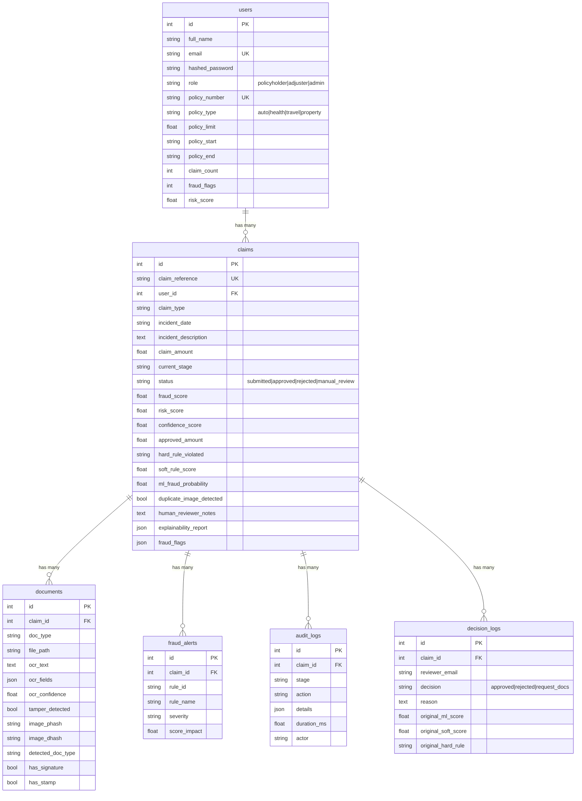
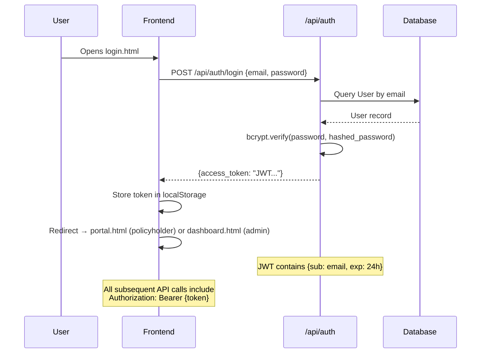
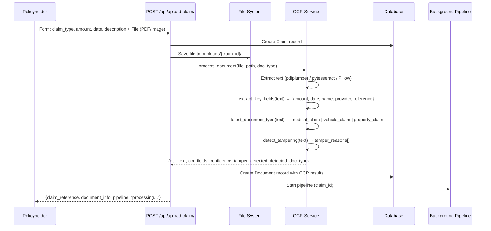
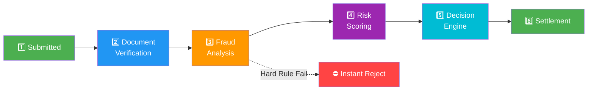
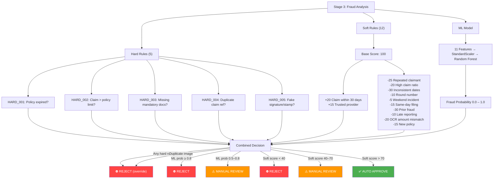
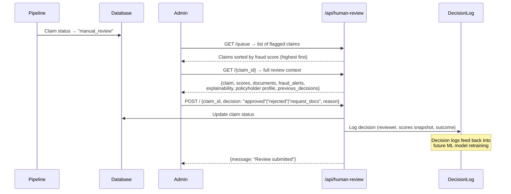
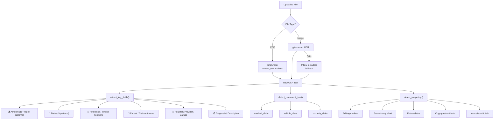
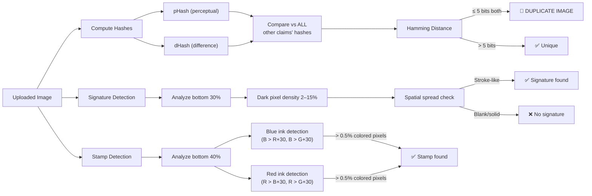

# ClaimIQ — Complete System Flow

## 1. High-Level Architecture

```mermaid
graph TB
    subgraph Frontend["🖥️ Frontend (Vanilla HTML/CSS/JS)"]
        LP["Landing Page<br/>index.html"]
        REG["Register<br/>register.html"]
        LOG["Login<br/>login.html"]
        POR["Policyholder Portal<br/>portal.html"]
        DASH["Admin Dashboard<br/>dashboard.html"]
        ABOUT["About AI<br/>about-ai.html"]
    end

    subgraph API["⚡ FastAPI Backend (port 8000)"]
        AUTH["Auth Router"]
        CLM["Claims Router"]
        DOC["Documents Router"]
        FRD["Fraud Router"]
        UPC["Upload Claim Router"]
        HRV["Human Review Router"]
        PIP["Pipeline Router"]
        DSH["Dashboard Router"]
        CPL["Copilot Router"]
        AUD["Audit Router"]
    end

    subgraph Services["🧠 Service Layer"]
        PIPE["Pipeline Service"]
        STP["STP Engine"]
        OCR["OCR Service"]
        IMG["Image Fraud Service"]
        EXP["Explainability Service"]
        AUDS["Audit Service"]
    end

    subgraph ML["🤖 ML Layer"]
        FE["Fraud Engine<br/>(Hard + Soft + Combined)"]
        MDL["Random Forest Model<br/>(fraud_model.pkl)"]
        TRN["Training Pipeline<br/>(train_model.py)"]
    end

    subgraph DB["💾 Database (SQLite / MySQL)"]
        T_USR["users"]
        T_CLM["claims"]
        T_DOC["documents"]
        T_FRD["fraud_alerts"]
        T_AUD["audit_logs"]
        T_DEC["decision_logs"]
    end

    Frontend --> API
    API --> Services
    Services --> ML
    Services --> DB
    ML --> DB
```



---

## 2. Database Schema (6 Tables)



---

## 3. User Authentication Flow



**Roles:**
| Role | Pages | Capabilities |
|------|-------|-------------|
| `policyholder` | portal.html | Submit claims, upload docs, track pipeline, view AI explanation |
| `admin` | dashboard.html | View all claims, manage fraud model, human review queue, approve/reject |

---

## 4. Claim Submission Flow (Two Paths)

### Path A: Simple Claim (No File)
```
POST /api/claims/submit
  Body: {claim_type, incident_date, incident_description, claim_amount}
  → Creates Claim record (status: "submitted")
  → Kicks off Pipeline in background thread
  → Returns claim_reference immediately
```

### Path B: Combined Upload (Claim + File)


---

## 5. The 6-Stage Processing Pipeline ⭐

This is the **core of the system**. Each claim passes through 6 stages sequentially in a background thread.



### Stage 1: Submitted
- Records `submitted_at` timestamp
- Audit log: claim queued for processing

### Stage 2: Document Verification + Image Fraud Scan
```
For each uploaded document:
  1. Check required docs present (by claim_type)
  2. Run image fraud detection:
     a. Compute pHash + dHash → store on document record
     b. Compare hashes against ALL other claims → find duplicates (Hamming dist < 5)
     c. Check signature presence (dark pixel density in bottom 30%)
     d. Check stamp presence (blue/red ink detection in bottom 40%)
  3. Flag: duplicate_image_detected, signature_stamp_failed
```

### Stage 3: Fraud Analysis (Hard + Soft + ML)
This is the most complex stage — 3 parallel scoring systems:



> [!IMPORTANT]
> **Priority chain**: Hard Rules → Duplicate Image → ML Probability → Soft Score. A hard rule failure short-circuits the entire pipeline into instant rejection.

### Stage 4: Risk Scoring
- Runs eligibility check (5 gates): amount limit, policy active, no prior fraud, eligible claim type, claim count
- Calculates settlement: `approved = (claim_amount - deductible) × risk_adjustment`
- Deductibles: auto 10%, health 5%, travel 8%, property 12%
- Risk adjustment: -10% for medium risk, -5% for low-moderate risk

### Stage 5: Decision Engine
- Uses the combined decision from Stage 3
- Falls back to legacy STP decision if combined is unavailable
- Calculates confidence score (60–95%)
- If hard rule rejection → already short-circuited in Stage 3

### Stage 6: Settlement
| Decision | Status | Payout Status | Action |
|----------|--------|---------------|--------|
| `auto_approved` | approved | processing | Settlement proceeds |
| `rejected` | rejected | rejected | Amount → $0 |
| `manual_review` | manual_review | pending | → Human Review Queue |

Final actions:
- Generate **Explainability Report** (factors, risk breakdown, bullet points, recommendation)
- Update user stats (claim_count, fraud_flags)
- Mark pipeline `completed`

---

## 6. ML Model Training Pipeline

```mermaid
flowchart LR
    CSV["datasets/<br/>insurance_claims.csv"] --> LOAD["Load & Prepare"]
    LOAD --> MAP["Auto-map Kaggle<br/>column names"]
    MAP --> DERIVE["Generate derived<br/>features if missing"]
    DERIVE --> SPLIT["80/20 Train/Test<br/>Stratified Split"]
    SPLIT --> SMOTE["SMOTE<br/>Oversampling"]
    SMOTE --> SCALE["StandardScaler"]
    SCALE --> TRAIN["Random Forest<br/>200 trees, depth=12"]
    TRAIN --> CV["5-fold Cross<br/>Validation"]
    CV --> EVAL["Evaluate:<br/>Accuracy, Precision,<br/>Recall, F1, ROC-AUC"]
    EVAL --> SAVE["Save:<br/>fraud_model.pkl<br/>scaler.pkl<br/>training_metrics.json"]
```



**11 Input Features:**
| # | Feature | Description |
|---|---------|-------------|
| 1 | `claim_amount` | Dollar amount claimed |
| 2 | `claim_to_limit_ratio` | Amount / policy limit |
| 3 | `prior_claims` | Count of past claims |
| 4 | `prior_fraud_flags` | Count of fraud flags on account |
| 5 | `days_since_incident` | Days between incident and filing |
| 6 | `policy_age_days` | Days since policy start |
| 7 | `is_round_number` | Claim amount divisible by 100 |
| 8 | `is_weekend` | Incident on Saturday/Sunday |
| 9 | `document_count` | Number of uploaded files |
| 10 | `ocr_mismatch` | OCR amount ≠ claimed amount (>15% diff) |
| 11 | `late_reporting` | Filed >30 days after incident |

**Output**: `fraud_probability` (0.0 – 1.0)

Admin can retrain via `POST /api/fraud/retrain` or upload a new CSV via `POST /api/fraud/upload-dataset`.

---

## 7. Human-in-the-Loop Review Flow



---

## 8. OCR + Document Intelligence



---

## 9. Image Fraud Detection



---

## 10. Explainability Report

Every processed claim gets a structured JSON report:

```json
{
  "decision": "APPROVED",
  "confidence": 85.0,
  "summary": "Claim auto-approved. All verification gates passed with minimal risk indicators.",
  "factors": [
    {"factor": "Claim amount is within normal range (30% of limit)", "impact": "LOW", "direction": "POSITIVE"},
    {"factor": "All required documents uploaded and verified", "impact": "LOW", "direction": "POSITIVE"}
  ],
  "risk_breakdown": {
    "fraud_risk": 15.0,
    "amount_risk": 30.0,
    "behavioral_risk": 0.0,
    "overall_risk": 25.0
  },
  "settlement_details": {
    "claim_amount": 1500.00,
    "approved_amount": 1282.50,
    "deductible": 150.00
  },
  "bullet_points": [
    "✅ Claim approved for $1,282.50",
    "✅ All eligibility checks passed",
    "✅ Low fraud risk score (15/100)"
  ],
  "recommendation": "No further action required. Settlement can proceed."
}
```

---

## 11. Complete API Map

| Group | Method | Path | Auth | Description |
|-------|--------|------|------|-------------|
| **Auth** | POST | `/api/auth/register` | — | Register new user |
| | POST | `/api/auth/login` | — | Login → JWT token |
| | GET | `/api/auth/me` | User | Get current user profile |
| | POST | `/api/auth/admin/seed` | Admin | Seed demo admin account |
| **Claims** | POST | `/api/claims/submit` | User | Submit new claim (no file) |
| | GET | `/api/claims/my` | User | Get my claims |
| | GET | `/api/claims/{id}` | User | Get single claim |
| | GET | `/api/claims/{id}/details` | User | Full claim details + explainability |
| | GET | `/api/claims/status/{id}` | User | Quick status check |
| | GET | `/api/claims/admin/all` | Admin | List all claims |
| | PATCH | `/api/claims/admin/{id}/decide` | Admin | Manual approve/reject |
| **Upload** | POST | `/api/upload-claim/` | User | Submit claim + file in one request |
| **Documents** | POST | `/api/documents/upload/{claim_id}` | User | Upload document to existing claim |
| | GET | `/api/documents/claim/{claim_id}` | User | Get claim's documents |
| **Fraud** | POST | `/api/fraud/retrain` | Admin | Trigger model retraining |
| | GET | `/api/fraud/training-status` | — | Current training job status |
| | GET | `/api/fraud/model-info` | — | Model metrics & dataset info |
| | GET | `/api/fraud/feature-importance` | — | Feature importance from model |
| | POST | `/api/fraud/upload-dataset` | Admin | Upload new training CSV |
| | GET | `/api/fraud/score/{claim_id}` | User | Full fraud score breakdown |
| **Human Review** | GET | `/api/human-review/queue` | Admin | Claims pending review |
| | GET | `/api/human-review/{claim_id}` | Admin | Full review context |
| | POST | `/api/human-review/` | Admin | Submit review decision |
| **Pipeline** | GET | `/api/pipeline/{claim_id}/status` | User | Real-time pipeline tracking |
| | GET | `/api/pipeline/{claim_id}/audit` | User | Pipeline audit trail |
| **Dashboard** | GET | `/api/dashboard/stats` | Admin | System-wide statistics |
| | GET | `/api/dashboard/model-stats` | Admin | ML model performance |
| | GET | `/api/dashboard/my-stats` | User | Personal claim stats |
| **Copilot** | POST | `/api/copilot/chat` | User | AI chat assistant (Gemini) |
| **Audit** | GET | `/api/audit/{claim_id}` | User | Claim audit trail |
| | GET | `/api/audit/recent-events` | Admin | Recent system events |

---

## 12. Frontend Pages

| Page | URL | Audience | Features |
|------|-----|----------|----------|
| **Landing** | `/` | Public | Hero section, feature showcase, register/login CTA |
| **Register** | `/register.html` | Public | Create policyholder account with policy details |
| **Login** | `/login.html` | Public | Email + password → JWT token |
| **Portal** | `/portal.html` | Policyholder | Submit claims, upload docs, real-time pipeline viz, AI explanations |
| **Dashboard** | `/dashboard.html` | Admin | All claims table, fraud model management, retrain controls, human review queue |
| **About AI** | `/about-ai.html` | Public | Model transparency, feature explanations, limitations disclosure |

---

## 13. End-to-End Flow Summary

```
1. Policyholder registers → User row created (policy_type, policy_limit, etc.)
2. Logs in → JWT token issued (24h expiry, bcrypt-verified)
3. Submits claim via portal → Claim row created
4. Uploads document → File saved, OCR processed, Document row created
5. Pipeline starts (background thread):
   a. Stage 1: Claim logged
   b. Stage 2: Docs verified + image fraud scan (hashes, duplicates, signatures)
   c. Stage 3: Hard rules → Soft rules → ML probability → Combined decision
   d. Stage 4: Eligibility gates + settlement calculation
   e. Stage 5: Final decision (auto_approve / reject / manual_review)
   f. Stage 6: Settlement + explainability report generation
6. If APPROVED → payout_status = "processing"
7. If REJECTED → approved_amount = $0
8. If MANUAL_REVIEW → enters Human Review queue
   a. Admin views queue → sees highest-risk claims first
   b. Admin reviews context → full scores, documents, fraud alerts, policyholder profile
   c. Admin decides: approve / reject / request_docs
   d. Decision logged to DecisionLog → feeds back into ML retraining
9. Audit trail captured at every stage
10. Explainability report generated → policyholder sees "why" for every decision
```
